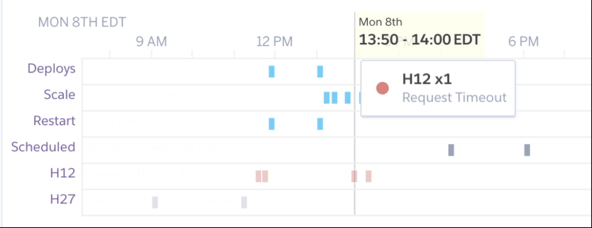
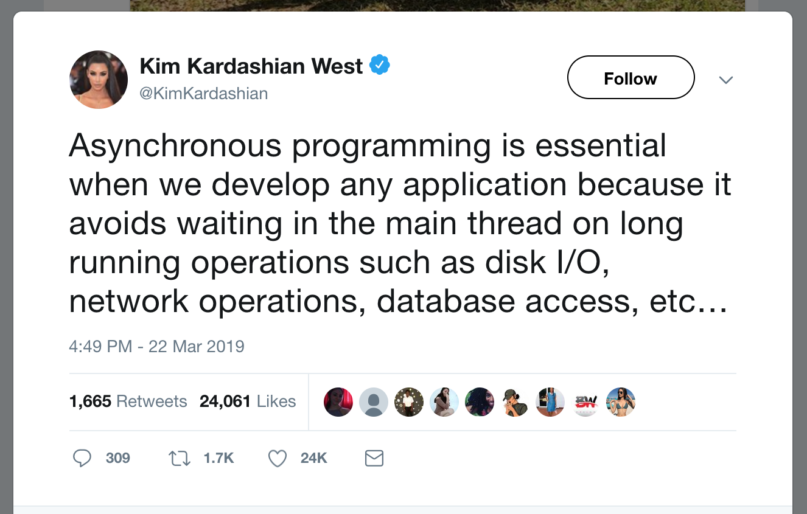
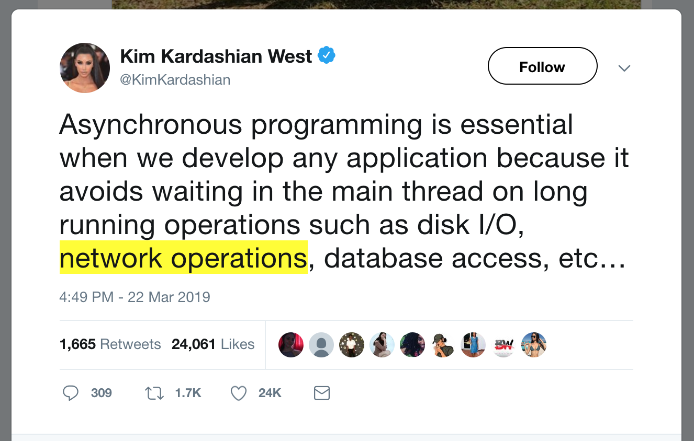
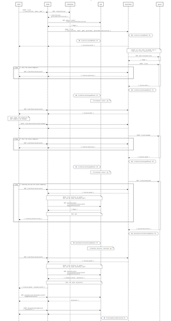

# embracing asynchrony

Note:

- imma talk about asychrony in programming
- where and why it's useful
- how we embraced asynchrony to improve bank linking at stash
- Start with a fun example

---

## fun example

@ul

- how to do async properly
- how to properly do async
- how properly to do async
- properly how to do async
- async properly do to how
  - ... 🤔

@ulend

Note:

- Another name for this talk, and another...
- (4)
- maybe you know where this is going. maybe why tf are you up here rearranging these five words?
- could have been delivered asynchronously, understandable
- until...

---


Note:

- story time

---

## story time

---



Note:

- Who recognizes this?
- H12

---

## here are some facts

@ul

- heroku has a global request timeout of **30 seconds**
- quovo's api takes somewhere between **5 and 55 seconds** to respond to us
- every quovo request is made **synchronously** within the user's heroku request cycle
- what could go wrong?

@ulend

Note:

- quovo bank link could be cut short by heroku
- we don't know the state it's in after that
- so... this leads to some pretty nasty hax

---

### monolith be like

```rb
class PlaidLinkController # oh dear
  def quovo_link
    begin
      catch_within_25_seconds_to_avoid_heroku_timeouts do
        if sync_already_happening(request)
          find_and_update_sync(request)
        else
          start_new_sync(request)
        end
      end
    rescue => e
      render 408, 'retry plz'
    end
  end
end
```

---

### clients be like

```js
try {
  post_bank_link_things(credentials);
} catch (e) {
  if (e.code == 408 && retries < 5) {
    // they told us it would be temporary
    retry_and_pray_it_works(retries - 1);
  } else {
    tell_the_customer_to_call_CX();
  }
}
```

---

## what to do?

@ul

- ~~ask heroku to up the timeout~~
- ~~heroku is mean~~
- keeping http connections open indefinitely is a terrible idea

@ulend

Note:

- so, what you're telling me is we need heroku to increase the connection timeout just for us
- that's not gonna happen >>>
- why? heroku is mean
- lol no >>>
- there's actually a reason why mean heroku has this limit >>>

---

## enter: async



---

## enter: async



Note:

- While we're making this blocking call to quovo for up to 25 seconds, that's one less process available to serve any other requests (or thread if your code is threadsafe)
- not scalable

---

### did someone say scalable threadsafe asynchronous programming?

@img[fragment](assets/img/scala.png)

Note:

- does anyone know a language that is literally named as an abreviation for the word scalable?
- so we decided to use scala for these reasons

---

### 1. decouple

#### client request to stash


#### stash request to quovo

Note:

- step 1 is taking the quovo requests out of the user request cycle

---

### 2. draw the rest of the owl



---


Note:

- no lol won't go into detail on the whole system
- here's a broad overview of how we re-wrote the request lifecycle

---

## 2. CQRS

@css[fragment](Command–Query Responsibility Segregation)

@css[fragment code](command 👉 "link a bank account.")

@css[fragment code](query 👉 "what the status of my link?")

<br>

@ul

- commands set an operation to run, and return immediately
- queries never have side effects

@ulend

Note:

- complete separation of reads and writes, GET vs POST
- scalable
- easier to reason about

---

### an asynchronous flow

```
1. COMMAND: link a bank account
   <- { "credentials": "P@ssw0rd!" }
   -> OK { "correlationId": "---some-uuid---" }

2. QUERY: what's the status of my link?
  -> OK { "status": "mfa", "question": "fave animal" }

3. COMMAND: answer mfa question
   <- { "answer": "kangaroo" }
   -> OK, 204 No Content

4. QUERY: what's the status of my link?
  -> OK { "status": "good" } 🎉
```

Note:

- generate a uuid and return instantly, process in background
- every one of these requests can return instantly
- quovo all happens in the background and we keep and internal representation of the link
- yay! revolutionalized bank linking

---

## gotchas

@ul

- quering before anything happens
- the "syncing" state
  - command: -> start link
  - query: -> syncing
  - query: -> syncing
  - query: -> syncing
  - query: -> syncing
  - query: -> syncing
  - query: -> good!

@ulend

Note:

- we could have told a client that if we return a 404, to try again, but that's implementation detail leak
- in practice, the link cycle ends up looking more like:
- no connection dropping/retry logic in the client

---

# summary

@ul

- asynchrony is essential for server-side network requests
- pull as much out of the client's request cycle as possible
- CQRS is kinda cool

@ulend

Note:

- new bank linking experiment shipped in the latest ios release

---

# cheers 🍻

questions?
